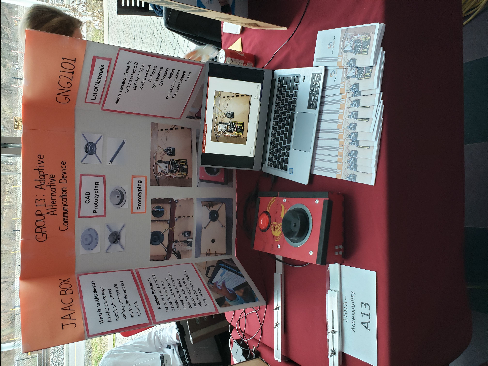
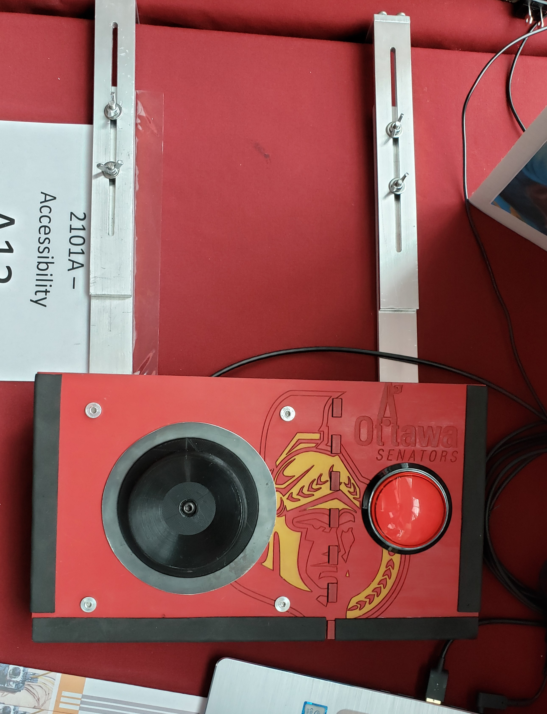
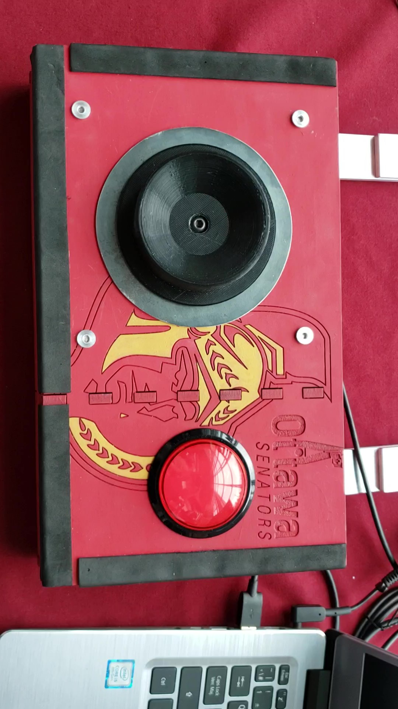
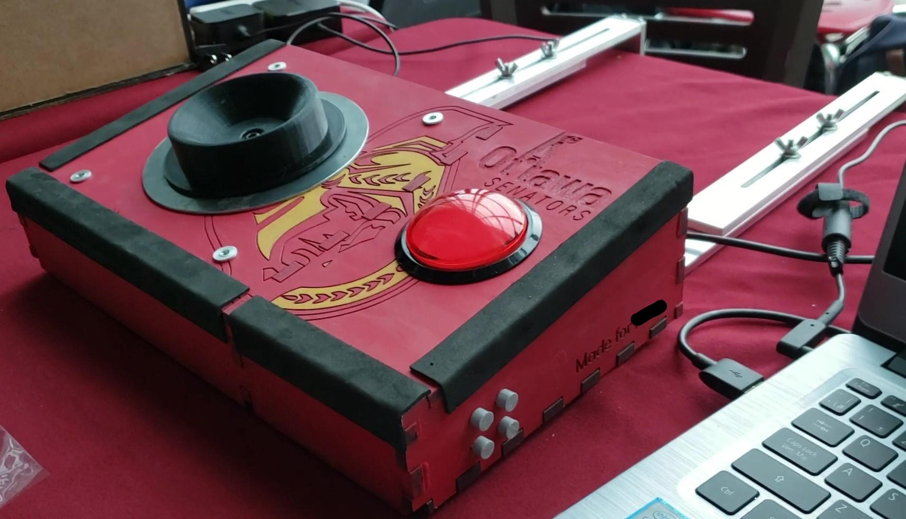

# Adaptive Alternative Communication Device (AACD) - joystick software

Arduino joystick code for 360-degree, variable speed movement

A client with Multiple Sclerosis required an alternative method to interact with a computer, as they only had control over their left leg. As a team, a foot operated mouse, programmed using an Arduino Leonardo, was constructed using 3D printing, lazer cutting and AutoCAD building techniques. This allowed the client the ability to operate the cursor at a 360-degree rotation, as well as utilize a selection button with solely their left foot.

Using the Arduino joystick example as a reference, this code was created to allow for full 360 degree rotation and variable speed depending how far the joystick is held from the point of origin.

## Features of the AACD:

    - The device was rigid, lightweight and water resistant due to 1/4" MDF board treated with two layers of paint followed by two layers of enamel.
    - The 3D printed heel cup attached to the joystick was both accurate and comfortable due to sufficient depth and surrounding walls providing heel stability.
    - The large red button shared identical functionality to the left click of a computer mouse.
    - Foam padding along the exterior edges of the device to act as a protective layer for the user.
    - Flat bar aluminum rails were used to anchor the device to the end of the bed, providing stability. The rails were able to extend and lock in place, allowing the user to use the device in any seated or laying down position.
    - The device was personalized by laser cutting the logo of the client's favourite hockey team on the top of the device. Also, the client's name was laser cut onto the side of the device (covered for privacy).

